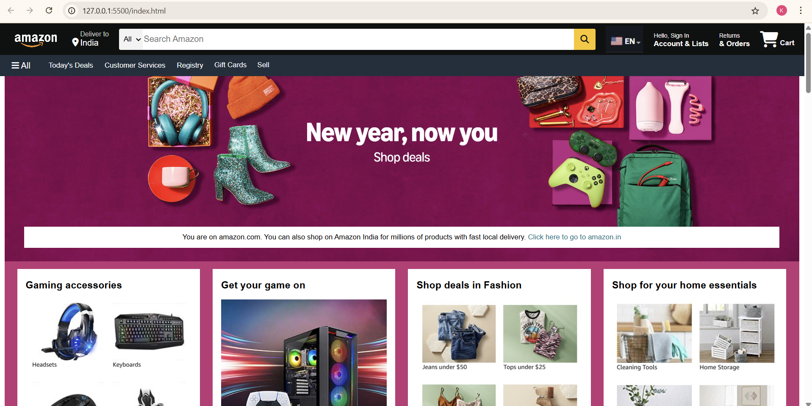

# 🛒 Amazon Clone – Frontend Project using HTML, CSS & JavaScript

A responsive **Amazon-like landing page clone** created using only **HTML**, **CSS**, and **Vanilla JavaScript**. This project replicates the look and feel of Amazon's homepage, showcasing product boxes, a navigation bar, search functionality, and responsive UI design — perfect for front-end learning and portfolio building.

---

## 🚀 Features

- 🧭 Fully responsive **Amazon-style navigation bar**
- 🔎 **Search bar** with alert handling on empty input
- 🖼️ Product **image boxes** designed with CSS Grid and Flexbox
- 🌐 **Font Awesome** icons integrated for visual polish
- 🧹 Organized folder structure for scalability
- 🔝 “Back to top” functionality for long pages
- 📦 Hover effects, product sections, and category links

---

## 🧠 Tech Stack

- **HTML5**
- **CSS3**
- **JavaScript (ES6)**
- **Font Awesome (CDN)**

---

## 📸 Preview

| Homepage View |
|---------------|
|  |


## 🏗️ Folder Structure

```plaintext
amazon-clone/
│
├── index.html            # Main HTML file
├── style.css             # All styling rules
├── script.js             # Handles alert on search
├── /boxes                # Folder for image files
│   ├── box_1.png
│   ├── box_2.jpg
│   └── ...
├── /longboxes            # Folder for image files
│   ├── longbox_1.png
│   ├── longbox_2.jpg
│   └── ...
├── /logo_images          # Folder for image files
│   ├── amazon_logo.png
│   ├── EN_logo.jpg
│   └── ...
| 
└── README.md             # Project documentation
